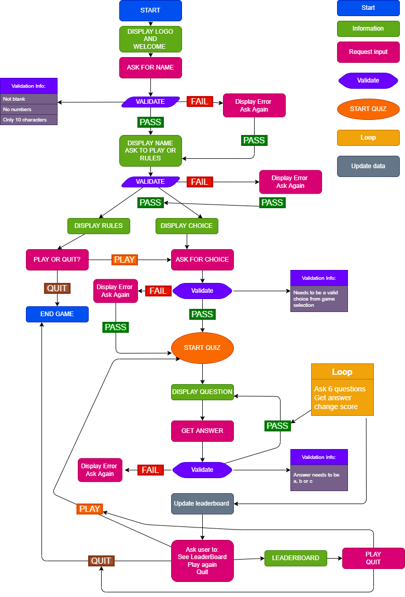

# Six Nations Rugby Quiz

For my **Portfolio 3 Project** on the **Code Institute's Diploma in Software Development (E-commerce Applications)** course I have created a command line Six Nations Rugby Quiz game.  Just like the tournament itself there are six sections for each of the countries.  The user will be asked 5 random questions in each section relating to a particular country.  The user can select whichever country they want to start with and work their way through each country, when their score will be totalled and they will find out if they made the leaderboard or not!   

Link to the deployed app is [here](https://sixnationsrugbyquiz.herokuapp.com/). 

-----

## Objective?
To deliver a command line quiz that is interactive and fun for the users, particularly anyone who likes Rugby   
 
-----

## User Experience

### From a User's Perspective
As a user it is important: 

1. That it is easy to follow the game. 
2. To understand the rules of the game. 
3. To understand how to start the game. 
4. To choose a game they want to play.
5. To quit the game if they want to. 
6. To answer questions and receive a result. 
7. To view their scores. 
8. To view the leaderboard.  

### Users Fulfilment

1.  The game is laid out clearly so the user knows immediately what to do.  A welcome message is provided prompting the user for their name. 
2.  Rules are available for the user to view. 
3.  Clear instructions are given on how to start the game.
4.  Clear instructions are given on how to select the country they want to play. 
5.  The user is given opportunities to quit the game throughout. 
6.  The user is asked multiple choice questions which they can answer by typing in a letter and are given a result as to whether they answered correctly or incorrectly. 
7.  After each section ends the user is shown how they scored in that round. 
8.  At the end of the game and if they quit the user is given the option to view the leaderboard. 

-----
## UX 

While I did want to give the game a bit of design it was designed minimally as the instructions were to produce a command line interface application.  Minimal styles were achieved by adding a background image, adding a mock screen and color to the 'Let's Play' button. 

### Python Logic

I created a flow chart using draw.io.  The chart gave me an idea of the flow of the game and how the game would progress, paying particular attention to user input and validation.  While some changes have been made to the quiz since drafting this flow chart it was extrememly beneficial in how the quiz was put together.  

### Existing Features

- Startup Display
  - The first display the user will see is the startup screen showing the logo done with ASCII art with the words "Rugby Quiz".  
  - A welcome message tells the user a small bit about the game.
  - The user is prompted to enter in their name. 
  - The user will then be asked to read the rules of play the game. 

Startup Display
 

 

- Rules
  - If the user selects to view the rules the rules are shown setting out the game.  The user will be told that there are six sections, one for each country that take part in the Six Nations Rugby Championship.  Users are told the questions are multiple choice and can be answered by typing in "a", "b" or "c".    The user will then be asked to play or quit. 

Rules Display
 

 

- Choices Menu
  - If the user chooses to play a list of choices will show for each country.  The user can select one of the six countries by typing in "eng" for England, "ire" for Ireland, "sc" for Scotland, "wal" for Wales, "fr" for France and "sc" for Scotland.  The user can select whichever country they wish to start on. 

Choices
 

 

- Quiz Questions
  - Once the user makes a choice of which country they will be asked 5 questions in relation to that country.  The questions are displayed with the available answers underneath.  The user is prompted to pick and answer by typing a, b, or c.  
    - Correct Answer 
      - If the user answers correctly it will be displayed in green. 
      

      
Correct Question Display
 
      

      

       
    - Incorrect Answer
      - If the user answers incorrectly it will be displayed in red. 

      

      
Incorrect Question Display
 
      

      

       

- Section Results
  - Once all questions have been answered in the Quiz Questions section a results page will open up telling the user how many points they scored in that section.  The user can then decided to continue playing or to quit the game. 

  

  
Section Results Display
 
  

  

   

- Remaining Choices 
  - If the user decides to continue playing after Section results then they will be given a list of remaining countries to choose from.  Once they choose another country they will be re-directed to the Quiz Questions, then Section results and back to Remaining Choices until all games have been completed.

  

  
Remaining Choices Display
 
  

  

     

- No Choices Left
  - Once all games have been completed the user will be directed to the a screen telling them that they have no choices left to play.  The user is asked if they want to see the leaderboard or to quit the game.

No Choices Left Display
 

      

- Leaderboard
  - If the user chooses to view the leaderboard a banner with the word "Leaders" will appear and a table beneath it showing the top three highest scores.  Users names are displayed along with scores for each country. The user is thanked for playing and directed to click the button below the terminal if they want to play again. 

Leaderboard Display
 

   

- Quit Screen 
  - There are two quit screens:
    - Quit Screen before Play
      This is a simple screen that appears after the Rules display if the user decides not to play.  It will display a message to the user saying goodbye and redirecting them to the 'Let's Play' button below the terminal. 

    

    
Quit Screen Before Play Display
 
    

    

     

    - Quit Screen Mid-Quiz
      This screen is displayed if the user wants to quit half way through the game.  The user is asked if they would like to see the leaderboard before they go or just quit.  Leaderboard will bring them to the Leaderboard section and quit will bring them to the quit screen mentioned above. 

### Data Model

I used google sheets to store usernames and scores for the Leaderboard.  I used one sheet for this.  In the main run.py file I created a dictonary to hold values as the user played the game.  Once the game was played the values from the dictonary were then appended to the rows in google sheets.  I also used this dictonary to total scores for each section which was also appended to google sheets.  This allowed me to sort the data in google sheets and display the three highest scores to the user.  The game was originally intended to be called True or False hence the name of the google sheet.

Google Sheets
 

 

### Design  

Design was limited for this project as it was primiarily command line based.  I did however want to give it some element of design so positioned the terminal to the center of the screen to make it look like a tv screen.  I added a background image of a stadium which complimented the quiz.   

#### Colors 

- #000 - Terminal Screen background
- #013220 - Let's Play Button
- #2F4F4F - Border on Let's Play Button

-----
## Future Implementation 

- User Log-In Function
  - A user log-in function where the user can register with name and password and come back to the game by login. 

- Bigger Question Bank 
  - I would like to make a bigger question bank so that when users come back they are not being asked the same questions.  While there are 9 questions in each country and only 5 randomingly asked I think a much bigger bank would make it more interesting.  These questions would be updated each year.   

- Information Section 
  - Information the user can access in relation to the Six Nations Rugby Championship such as game times, player stats etc. 

- Profanity Checker
  - So that users cannot add names with profanity in them. 

- Timer
  - With a timer the users would be unable to look up answers online. 

-----
## Technologies Used 

- [HTML5](https://en.wikipedia.org/wiki/HTML5) to provide content and structure to the website.
- [CSS3](https://en.wikipedia.org/wiki/CSS) provides styles for the website.
- [Python](https://www.python.org/) to provide functionality to the website. 
- [a11y](https://color.a11y.com/Contrast/) to test contrast. 
- [TinyPNG](https://tinypng.com/) to compress images.
- [Cloudinary](https://cloudinary.com/) to store images. 
- [GitPod](https://www.gitpod.io/) to create and edit the website. 
- [GitHub](https://github.com/) to host website
- [GitBash](https://www.atlassian.com/git/tutorials/git-bash#:~:text=What%20is%20Git%20Bash%3F,operating%20system%20through%20written%20commands.) to push changes to GitHub.
- [Heroku](https://id.heroku.com/login) to deploy the website. 
- [Balsamiq](https://balsamiq.com/) to create wireframes. 
- [Draw.io](https://drawio-app.com/) to create logic flow chart. 
- [vsCode](https://code.visualstudio.com/) to create logic flow chart.
- [Google-Sheets](https://www.google.com/sheets/about/) to store username and scores. 
- [Google Chrome Dev Tools](https://developer.chrome.com/docs/devtools/) to debug and test responsiveness.

-----
## Resources 

- [Code Institute](https://codeinstitute.net/ie/) for course materials, tutor and mentor support, in particular the use of google sheets and deployment to heroku.
- [Slack](https://slack.com/intl/en-ie/) in particular the Code Institute Slack Community.
- [W3schools](https://www.w3schools.com/) 
- [Brock Byrd](https://brockbyrdd.medium.com/creating-a-multiple-choice-quiz-in-python-terminal-1c46123b86d5) for quiz question layout.
- [Appdividend](https://appdividend.com/2022/01/29/how-to-clear-console-in-python/) to clear the console.
- [dev.to](https://dev.to/wangonya/when-to-use-python-s-enumerate-instead-of-range-in-loops-3e03) - to enumerate over a list.
- [W3schools](https://www.w3schools.com/python/ref_string_center.asp) to center text in the terminal. 
- [Stack OverFlow](https://stackoverflow.com/questions/47984091/print-dictionary-value-into-string-with-python3-6) to iterate through a dictionary. 
- [thispointer.com](https://thispointer.com/convert-dictionary-values-to-a-list-in-python/) to convert specific values of a dictionary list. 
- [Stack OverFlow](https://stackoverflow.com/questions/50938274/sort-a-spread-sheet-via-gspread) to sort rows in google sheets. 
- [Pexels](https://www.pexels.com/) for background stadium image. 

- Rugby Questions:
  - [SixNationsrugby.com](https://www.sixnationsrugby.com/competition/guinness-six-nations-2019-quiz-round-three/)
  - [Wikipedia Six Nations](https://en.wikipedia.org/wiki/Six_Nations_Championship)
  - [Funtrivia](https://www.funtrivia.com/trivia-quiz/Sports/Italy-at-the-Six-Nations-357331.html)
  - [Wikipedia - Italy](https://en.wikipedia.org/wiki/Italy_national_rugby_union_team#Six_Nations)
  - [Rugby World Cup](https://www.rugbyworldcup.com/2021/news/570281)
  - [Wikipedia - Scotland](https://en.wikipedia.org/wiki/Scotland_national_rugby_union_team#:~:text=Scotland%20competed%20in%20the%20Five%20Nations%20from%20the,change%2C%20Scotland%20have%20yet%20to%20win%20the%20competition.)
  - [Wikipedia - Wales](https://en.wikipedia.org/wiki/Wales_national_rugby_union_team#Coaches)
    

## Python Libraries/Modules/API

- [Tabulate](https://pypi.org/project/tabulate/) to print leaderboard tables.
- [Pyfiglet](https://pypi.org/project/pyfiglet/0.7/) for ascii art.
- [Colorama](https://pypi.org/project/colorama/) to add color. 
- [Random](https://www.cs.swarthmore.edu/~adanner/cs21/f09/randomlib.php#:~:text=Using%20the%20random%20library&text=The%20random%20module%20provides%20access,the%20basic%20features%20of%20python.) to generate random questions.
- [Time](https://docs.python.org/3/library/time.html) to add delays.
- [gspread](https://docs.gspread.org/en/v5.3.2/) to communicate with google sheets
- [os](https://www.geeksforgeeks.org/os-module-python-examples/#:~:text=The%20OS%20module%20in%20Python,*os*%20and%20*os.) to clear terminal screen.

-----
## Testing

### User Testing

The website was sent to a group of approximately 15 people.  Users found the game easy to work through.  This testing for the most part produced spelling errors and complaints that some of the questions were too hard! 

### Manual Testing

I carried out manual testing to ensure that game flow was correct, everything was working as it should and validation caught any errors. 

- Tests carried out: 
  - Start-up Display - Verify that: 
    - The logo displays.
    - The welcome message displays with information on the game.
    - The user is prompted for their name.
    - The user can enter their name.
    - The user gets a warning message if the name is longer than 10 characters. 
    - The user gets a warning message if the name is just numbers. 
    - The user gets a warning message if the name is blank. 
  
  - Display Rules or Play - Verify that: 
    - The user is asked if they want to see the rules or play.
    - The user is prompted to type an "r" to see the rules and "p" to play. 
    - That warning message appears if anything other than a "p" or "r" is entered by the user. 
    - That the user is asked to enter "r" or "p" again.  
  
  - Rules - Verify that:
    - If the user types "r" the rules are displayed.
    - The message is clear to the user on how to play. 
    - The user is asked if they would like to Play or Quit. 
    - That the user is prompted to type in "p" to play or "q" to quit. 
    - That a warning message appears if anything other than a p or q is entered.  
  
  - Quit Early - Verify that: 
    - When the user types "q" to quit as above a message displays saying goodbye to the user and pointing out that if they wish to play they can click the Let's Play Button. 
    - By clicking the Let's Play Button the website is refreshed and the quiz re-starts. 
  
  - Quiz Choices - Verify that: 
    - If the user types p to play as above in the Rules Section that a list of choices appears to the user. 
    - That the list displayed contains the correct instructions to the user to proceed. 
    - That a warning will appear if the player chooses anything other than the six options above. 

    Quiz Questions - Verify: 

      **England**
      - That if the user types "eng" English questions will be displayed.
      - That five questions on English Six Nations Rugby will be displayed one at a time. 
      - That the user is asked an English Question. 
      - That the user is shown three mulitple choice answers. 
      - That if the user answers a question correctly a message will display in green telling them it is correct. 
      - That if the user answers a question incorrectly a message will display in red telling them that it is incorrect. 
      - That a warning will appear if the user enters anything other than a, b, or c to answer a question.  
      - That the next question will appear after the user answers a question and that this happens five times. 

      **Ireland**
      - That if the user types "ire" Irish questions will be displayed.
      - That five questions on Irish Six Nations Rugby will be displayed one at a time. 
      - That the user is asked an Irish Question. 
      - That the user is shown three mulitple choice answers. 
      - That if the user answers a question correctly a message will display in green telling them it is correct. 
      - That if the user answers a question incorrectly a message will display in red telling them that it is incorrect. 
      - That a warning will appear if the user enters anything other than a, b, or c to answer a question.  
      - That the next question will appear after the user answers a question and that this happens five times. 

      **Wales**
      - That if the user types "wal" Welsh questions will be displayed.
      - That five questions on Welsh Six Nations Rugby will be displayed one at a time. 
      - That the user is asked an Welsh Question. 
      - That the user is shown three mulitple choice answers. 
      - That if the user answers a question correctly a message will display in green telling them it is correct. 
      - That if the user answers a question incorrectly a message will display in red telling them that it is incorrect. 
      - That a warning will appear if the user enters anything other than a, b, or c to answer a question.  
      - That the next question will appear after the user answers a question and that this happens five times. 

      **France**
      - That if the user types "fr" French questions will be displayed.
      - That five questions on French Six Nations Rugby will be displayed one at a time. 
      - That the user is asked an French Question. 
      - That the user is shown three mulitple choice answers. 
      - That if the user answers a question correctly a message will display in green telling them it is correct. 
      - That if the user answers a question incorrectly a message will display in red telling them that it is incorrect.  
      - That a warning will appear if the user enters anything other than a, b, or c to answer a question.  
      - That the next question will appear after the user answers a question and that this happens five times. 

      **Italy**
      - That if the user types "it" Italian questions will be displayed.
      - That five questions on Italian Six Nations Rugby will be displayed one at a time. 
      - That the user is asked an Italian Question. 
      - That the user is shown three mulitple choice answers. 
      - That if the user answers a question correctly a message will display in green telling them it is correct. 
      - That if the user answers a question incorrectly a message will display in red telling them that it is incorrect. 
      - That a warning will appear if the user enters anything other than a, b, or c to answer a question.  
      - That the next question will appear after the user answers a question and that this happens five times. 

  - Section End - Verify: 

    - That when five questions are answered by the user a message appears telling them how many points they scored for that country. 
    - That a message displays saying "Updating scores...."
    - That a question appears asking the user if they want to play or quit the game. 
    - That the user is prompted to enter a "p" to play or "q" to quit. 
    - That a warning message appears if they enter anything other than "p" or "q". 

      Quit Midway - Veryify: 

      - That if the user types "q" a message will display asking if the user wants to see the leaderboard before they quit. 
      - That the user is prompted to type "s" for leaderboard and "q" to quit.
      - That if the user types "s" the leaderboard is displayed.
        - That the leaderboard appears showing the top three players. 
        - That the leaderboard shows the Name of each player and how many points they scored in each section. 
        - That a message appears under the leaderboard saying goodbye and thanking the user for playing.
      - That if the user types "q" that a message appears saying goodbye to the user and if they change their mind they can play again by clicking the Let's Play button below the terminal. 
  
  - Next Section Play - Verify: 

    - That the the remaining choices left to play are displayed. 
    - That the user is prompted to select another country. 
    - That if anything other than a country choice is entered a warning message appears. 
    - That if the user enters a correct country that country's questions will appear next and that all questions work for each country as outlined above under Quiz Questions. 
  
  - Quiz End - Verify: 
    - That a message appears telling the user they have answered all sections.
    - That the user is asked if they want to see the leaderboard or quit. 
    - That the user is prompted to type "s" for leaderboard or "q" to quit. 
    - That if the user types anything other than "s" or "q" that a warning message will appearing prompting them to put in the correct letter. 

  - Leader Display - Veryify that: 
    - If the user types "s" above that a leader board will display showing the word "Leaders" in green done with ascii art. 
    - That the leaderboard appears showing the top three players. 
    - That the leaderboard shows the Name of each player and how many points they scored in each section. 
    - That a message appears under the leaderboard saying goodbye and thanking the user for playing.

### Browser Testing

The Website has been tested on Google Chrome, Microsoft Edge, Safari and Opera.   On all browsers testing was as expected.  

### Validators 

The three python files were tested using [Pep8 Validation](http://pep8online.com/checkresult). 

run.py Validation
 

 

quest.py Validation
 

 

info.py Validation
 

 

###  Result: Chrome Lighthouse 

I used Chrome Lighthouse to test Performance on the website. 

Lighthouse Validation
 

 

### Color Contrast Testing 

I used [a11y](https://https://color.a11y.com/) to test the color contrast on the website which produced no issues. 

Color Contrast 
 

 

### Issues/Bugs Fixed 

**Space or no input from user**

Initially I had thought that I validated for all user input until I entered nothing into the username and hit enter.  This allowed the user to have no name which would cause errors in relation to the leaderboard.   I fixed this by using strip() with a combination of checking for length on the input. 

Spacing/Blank Error

 

**Errors in GitPod**

As I worked in GitPod I used the problems menu constantly.  For the most part the errors were in relation to whitespaces, indentations and two line spacing before functions.  I fixed the errors as I went so when it came to validating my code with the PEP8 validator there were no errors and my code was clean.  

GitPod Errors

 

**Leaderboard Update**

If the user started to play the quiz but just got as far as inputting their name and then quit the game this would affect the leaderboard and it wouldn't sort.  I fixed this by not giving the user access to the leaderboard unless the game was played.

### Issues Unresolved

**Profanity Error**

I had hoped to put in a profanity filter for the username.  I attempted to install the profanity library however every attempt affected deployment.  I tried different libriaries all of which failed.  Deployment was more important than profanity filters and I made the decision to leave it out of this project.  I hope to come back to it in the future.  

Heroku Fail

 

-----
## Version Control

### Git and GitHub 

Local repository and IDE used: GitPod
Remote repository used: GitHub

Steps followed: 
- I created a new public repository on GitHub using the Code Institute template.
- I then created a workspace and started coding on GitPod. 
- All relevant files were created. 
- To save my work safely I continued to use the terminal consistently by using: 
    - **git add .** to add work to git
    - **git commit -m""** to commit the work 
    - **git push** to update work to GitHub 

### Deployment to Heroku

The website was deployed to heroku by doing the following: 

1. Navigate to [heroku](https://id.heroku.com/login). 

2. Click "new" and create a new App. 

  

  
New App

  

  

   

3. Give your app a name, choose your region and Click "Create app". 

  

  
Name and Create

   
  

  

4. The menus that we are concerned with are "Deploy" and "Settings".  Click on "Settings" First. 

  

  
Settings

   
  

  

5. Copy the contents of the creds.json file.  Insert "CREDS" into the key field and the entire contents of the file into the value field.  The template code provided will use this information to create the file called creds.json and write this data into it as the application is built. 

  

  
Convig vars

   
  

  

6. Buildpacks now need to be added.  These install future dependancies that we need outside of the requirements file.   The first is python and the second is node.js.  Select Python first and then node.js and click save.  Make sure they are in this order.

  

  
Buildpacks

   
  

  

7. Then go to the deploy section and choose your deployment method.  To connect with github select github and confirm. 

  

  
Connect to github

   
  

  

8. Search for your repo, select it and click connect. 

  

  
Repo Search

   
  

  

9. You can choose to either deploy using automatic deploys which means heroku will rebuild the app everytime you push your changes.  For this option choose the branch to deploy and click enable automatic deploys.  This can be changed at a later date to manual.  Manual deployment deploys the current state of a branch.  

  

  
Manual Deployment

   
  

  

  

  
Automatic Deployment

   
  

  

10. Click deploy branch. 

11. If successful you should be able to view your deployed app by clicking "View". 

  

  
View Deployment

   
  

  

        
    

  ### Fork a Repository: 
        
    A copy can be made of a repository by forking the repository.  The copy can then be viewed and changed without affecting the original repository. 
    
      - From your list of repositories select the repository you want to fork.
      - On the top of the page to the right had side you will see a fork image.  Click on the button to create a copy. 

      
  

Fork Preview Image

 

  ### Clone a Repository: 
        
    Cloning this project from GitHub can be done by following these steps: 
    
      - From your list of repositories select the repository you want to deploy.
      - Click on the code tabe. 
      - Click on the clipboard icon to copy the URL.  
      - Open Git Bash in your IDE. 
      - Change the current working directory to the location you want to place the clone. 
      - Type git clone and paste the copied URL.  
      - Press enter for the clone to be created. 

  

Clone Preview Image

 

 

## Credits 

Initially I looked at Portfolio 3 Projects on the Code Institute Slack Community to get some inspiration.  I found two quiz apps created by [Mike](https://github.com/MikeR94) and [Dave](https://github.com/DaveyJH).  Those two were massive quizzes to follow and honestly a bit overwhelming.  It was from Mike's readme that I saw the blog from [Brock Byrd](https://brockbyrdd.medium.com/).  Like Mike I followed this and primarily used the setup of Brock's questions and answers from this blog.  From this I slowly built my app using the resources mentioned above I made it my own.  I actually really enjoyed putting this together.  

-----
## Acknowledegments/Conclusion

I couldn't complete this without the massive support I get from my Code Institute cohort in particular [Kasia](https://github.com/bezebee), our cohort facilitator and a special mention to [Rhi](https://github.com/rhiannonmcn) for being a great sounding board a few times throughout this project.  Sometimes it's great to just say things out loud to others and bounce ideas off eachother!  Thanks to my mentor Spencer for being a great support and a really nice guy!  Last but not least my husband for helping with the rugby questions, bringing me tea and generally holding the fort while I work on projects.     

Rachel Rock April 2022
